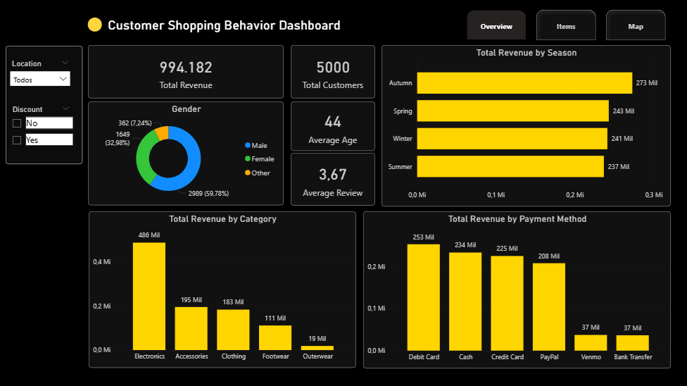
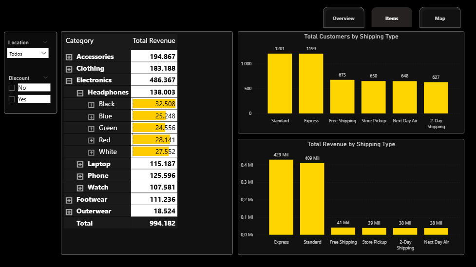
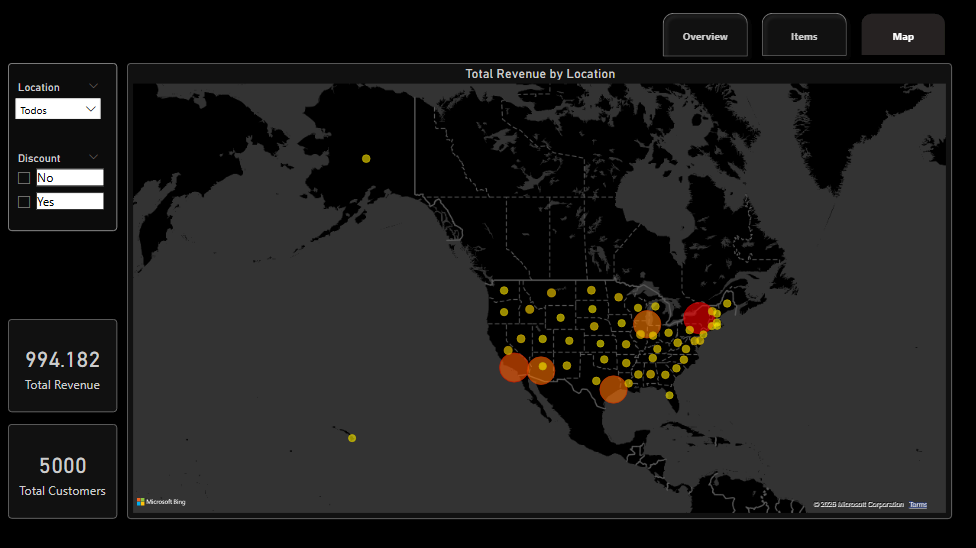

# Customer Shopping Behavior Dashboard

Dashboard desenvolvido no **Power BI** para análise do comportamento de compra de clientes, cobrindo **5.000 clientes** e um total de **994 mil em receita**.

---

## Páginas

### 📊 Overview

Visão geral com os principais indicadores e distribuições agregadas com valores em Dólar.

**KPIs**
- **Total Revenue:** receita total gerada no período
- **Total Customers:** quantidade total de clientes
- **Average Age:** média de idade dos clientes
- **Average Review:** média de avaliação das compras

**Visuais**
- **Donut — Gender:** distribuição dos clientes por gênero (Male, Female, Other)
- **Barras horizontais — Total Revenue by Season:** receita por estação do ano, com Autumn liderando (273K)
- **Barras verticais — Total Revenue by Category:** receita por categoria de produto, com Electronics dominando (486K)
- **Barras verticais — Total Revenue by Payment Method:** receita por meio de pagamento, com Debit Card no topo (253K)

---

### Items

Detalhamento hierárquico das vendas com drill-down por categoria, produto e cor.

**Visuais**
- **Matriz — Category / Total Revenue:** permite expandir cada categoria até o nível de cor do produto, com destaque visual nas linhas selecionadas
- **Barras verticais — Total Customers by Shipping Type:** volume de clientes por tipo de entrega, com Standard liderando em quantidade (1.201)
- **Barras verticais — Total Revenue by Shipping Type:** receita por tipo de entrega, com Express liderando em valor (429K) apesar de ter menos clientes que Standard

---

### Map

Distribuição geográfica da receita com KPIs contextuais.

**Visuais**
- **Mapa de bolhas — Total Revenue by Location:** concentração de receita por cidade nos Estados Unidos, com gradiente amarelo > laranja > vermelho indicando volume crescente
- **KPIs laterais:** Total Revenue e Total Customers atualizados conforme filtro de localização

---

## Filtros

Todas as páginas contam com filtros interativos de **Location** e **Discount**, aplicados globalmente ao dashboard.

---

## 📦 Ferramentas

- Power BI Desktop
- Dataset: Customer Shopping Behaviour Analysis — [Kaggle](https://www.kaggle.com/datasets/ankitrajmishra/customer-shopping-behaviour-analysis)
---

## 📧 Contato

**Vitor Fernando Pires Alves**
- **Email:** vitor.fpiresalves@gmail.com
- **LinkedIn:** [linkedin.com/in/vitor-fernando-pires-alves](https://www.linkedin.com/in/vitor-fernando-pires-alves)
